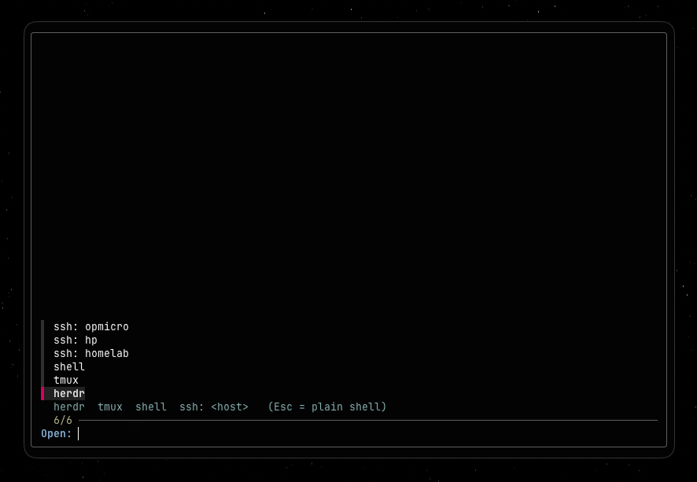

# selecta

Destination picker for new terminal windows. Every ghostty window opens a menu:
Herdr, Tmux, a plain shell, or SSH into any host in `~/.ssh/config`.



## Install

```sh
./install.sh
```

- Symlinks `selecta` to `~/.local/bin/selecta`.
- Replaces the `command =` line in the ghostty config
  (`~/Library/Application Support/com.mitchellh.ghostty/config.ghostty`) with
  `command = ~/.local/bin/selecta`, keeping a backup at `config.ghostty.bak-selecta`.
- Idempotent; the `env = PATH=...` line is left untouched.

Restart ghostty (or open a new window). To restore the old behavior, point
`command =` back at `ghostty-herdr-session` (see the backup file) and remove
the `~/.local/bin/selecta` symlink.

## Menu

| Entry        | Action                                             |
| ------------ | -------------------------------------------------- |
| `herdr`      | Launch/attach Herdr; returns to a zsh prompt after detach |
| `tmux`       | `tmux new -A` (attach most-recent session, else create); quitting closes the window |
| `shell`      | Fresh interactive login zsh                        |
| `ssh: <host>`| `ssh -t <host>`; runs `fastfetch` if available, then an interactive shell; quitting closes the window |

Esc or Ctrl-C lands on a plain shell. Set `SELECTA_SKIP=1` (e.g. a second ghostty
profile, or `ghostty -e env SELECTA_SKIP=1 selecta`) to skip the menu entirely.

## Requirements

zsh, fzf, tmux, herdr, and optionally fastfetch on remote hosts (the menu omits
entries for missing local binaries). Hosts come from `~/.ssh/config`; pattern
hosts (`*`, `?`, `!`) are skipped.
