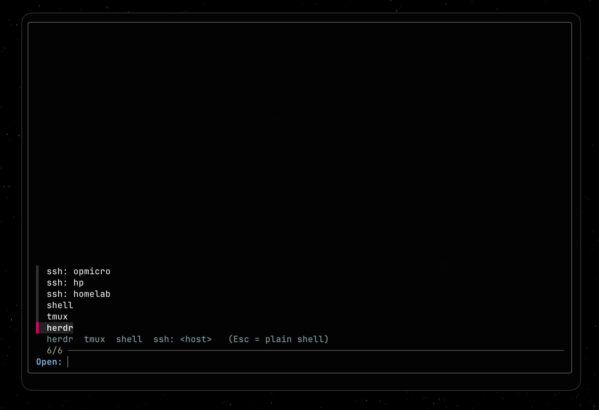

# selecta

Destination picker for new terminal windows. Two scripts with the same shape,
one per platform:

- `selecta` (zsh) - ghostty on macOS, and a shell inside WSL. Menu: Herdr,
  Tmux, a plain shell, or SSH into any host in `~/.ssh/config`.
- `selecta.ps1` (PowerShell 7) - WezTerm on Windows. Same fzf menu, with WSL
  in place of Tmux and PowerShell 7 as the plain shell.



## macOS and WSL (`selecta`)

Install:

```sh
./install.sh
```

- Symlinks `selecta` to `~/.local/bin/selecta`.
- Replaces the `command =` line in the ghostty config
  (`~/Library/Application Support/com.mitchellh.ghostty/config.ghostty`) with
  `command = ~/.local/bin/selecta`, keeping a backup at `config.ghostty.bak-selecta`.
- Idempotent; the `env = PATH=...` line is left untouched.

Restart ghostty (or open a new window). To restore the old behavior, point
`command =` back at `ghostty-herdr-session` (see the backup file) and remove
the `~/.local/bin/selecta` symlink.

Menu:

| Entry        | Action                                             |
| ------------ | -------------------------------------------------- |
| `herdr`      | Launch/attach Herdr; returns to a zsh prompt after detach |
| `tmux`       | `tmux new -A` (attach most-recent session, else create); quitting closes the window |
| `shell`      | Fresh interactive login zsh                        |
| `ssh: <host>`| `ssh -t <host>`; runs `fastfetch` if available, then an interactive shell; quitting closes the window |

Esc or Ctrl-C lands on a plain shell. Set `SELECTA_SKIP=1` (e.g. a second ghostty
profile, or `ghostty -e env SELECTA_SKIP=1 selecta`) to skip the menu entirely.

Requirements:

zsh, fzf, tmux, herdr, and optionally fastfetch on remote hosts (the menu omits
entries for missing local binaries). Hosts come from `~/.ssh/config`; pattern
hosts (`*`, `?`, `!`) are skipped.

## Windows (`selecta.ps1`)

No installer: point WezTerm at the script in `~/.config/wezterm/wezterm.lua`.

```lua
config.default_prog = {
  'pwsh', '-NoLogo', '-NoProfile', '-File',
  'C:\\Users\\kcao\\.local\\share\\selecta\\selecta.ps1',
}
```

| Entry         | Action                                                     |
| ------------- | ---------------------------------------------------------- |
| `herdr`       | Windows herdr; returns to a PowerShell prompt after detach |
| `wsl`         | `wsl.exe -d Ubuntu -- /bin/sh -c 'cd ~ && exec /usr/bin/zsh -l'` |
| `shell`       | `pwsh -NoLogo` (PowerShell 7 with your profile)            |
| `ssh: <host>` | `ssh -t <host>`; runs `fastfetch` if available, then an interactive shell; quitting closes the window |

Esc or Ctrl-C lands on a plain shell. Set `$env:SELECTA_SKIP=1` to skip the menu
entirely, and `$env:SELECTA_WSL_DISTRO` to use a distro other than `Ubuntu`.

Requirements: PowerShell 7, fzf (`scoop install fzf`), `wsl.exe`, the Windows
herdr build, and optionally fastfetch on remote hosts. The menu omits entries
for missing local binaries. Hosts come from `~/.ssh/config` on the Windows side.

Tests: `pwsh -NoProfile -File tests/run.ps1` (Windows), `tests/run.sh` (zsh).
